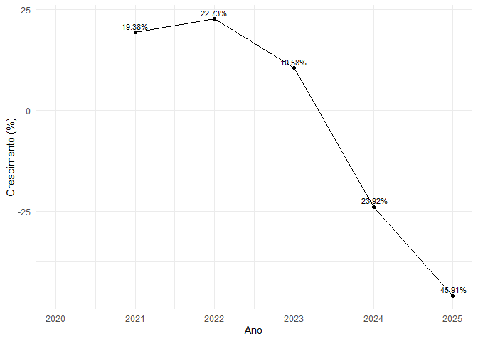
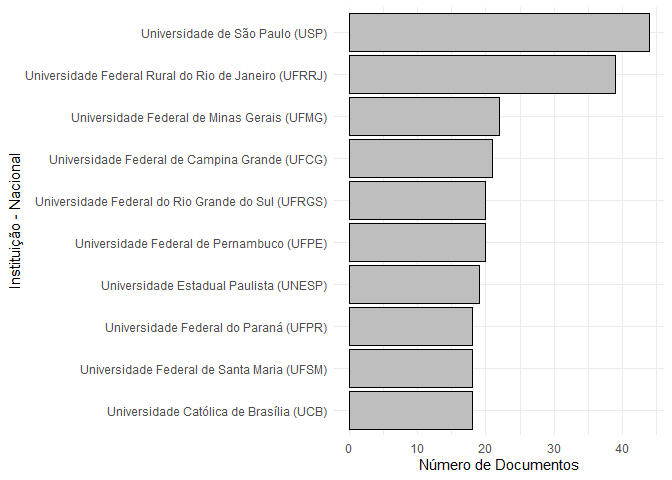
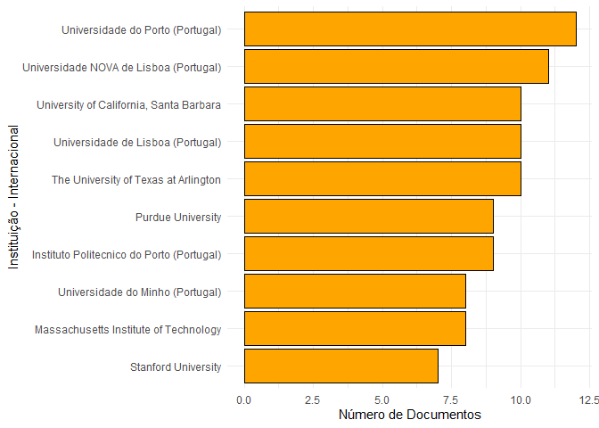
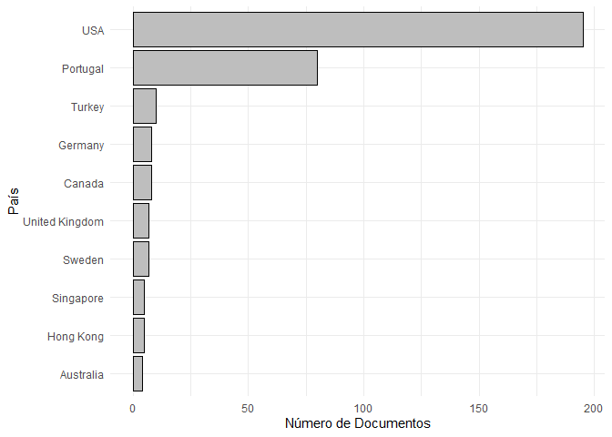
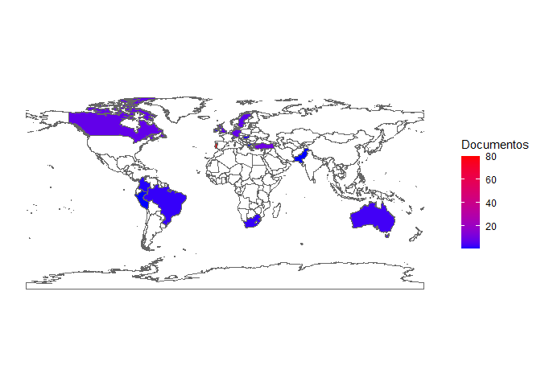
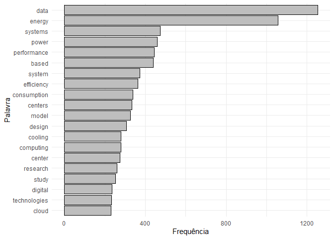

<!-- README.md is generated from README.Rmd. Please edit that file -->

## TCC - Maria Eduarda - Bibliometria

### Carregando Pacotes

``` r
library(tidyverse)
```

### Carregando a Base

``` r
base_wos <- readxl::read_xlsx("data_raw/wob_extraidos.xlsx") |> 
  janitor::clean_names() |> 
  mutate(
    abstract_1 = str_remove_all(abstract_1, "\r"),
    abstract_2 = str_remove_all(abstract_2, "\r"),
    research_areas   = str_replace_all(research_areas, "\n", " "),
    research_areas   = str_replace_all(research_areas, "  ", " "),
    titulo = str_remove_all(titulo, "\r|™"),
    autor = str_to_title(autor),
    nome_base = "wos"
  ) |> 
  rename( resumo = abstract_1)
base_me <- readxl::read_xlsx("data_raw/Arquivos Extraídos/search_result--1968698800-csv/search_result--1968698800-csv.xlsx") |> janitor::clean_names() |> 
  rename(autor = autor_a,ano = ano_de_defesa,
         instituicao = instituicao_de_defesa,
         pais = pais_da_instituicao_de_defesa) |> 
  mutate(pais = ifelse(pais == "Não informado pela instituição","Brasil",pais),
         assuntos_em_portugues = str_remove_all(assuntos_em_portugues,"\\|"),
         assuntos_em_ingles = str_remove_all(assuntos_em_portugues,"\\|"),
         autor = str_to_title(autor),
         nome_base = "bdtd")
```

``` r
glimpse(base_me) 
#> Rows: 587
#> Columns: 25
#> $ autor                                              <chr> "Reis, Thiago Nelso…
#> $ id_lattes_do_a_autor_a                             <chr> "http://lattes.cnpq…
#> $ orientadores                                       <chr> "TEIXEIRA, Mário An…
#> $ id_lattes_dos_orientadores                         <chr> "http://lattes.cnpq…
#> $ membros_da_banca                                   <chr> "TEIXEIRA, Mário An…
#> $ id_lattes_dos_membros_da_banca                     <chr> "http://lattes.cnpq…
#> $ titulo                                             <chr> "Sustentabilidade n…
#> $ ano                                                <dbl> 2024, 2025, 2021, 2…
#> $ instituicao                                        <chr> "Universidade Feder…
#> $ sigla_da_instituicao_de_defesa                     <chr> "UFMA", "UFMG", "UF…
#> $ pais                                               <chr> "Brasil", "Brasil",…
#> $ departamento_da_instituicao_de_defesa              <chr> "DEPARTAMENTO DE IN…
#> $ programa_de_pos_graduacao_da_instituicao_de_defesa <chr> "PROGRAMA DE PÓS-GR…
#> $ area_do_conhecimento_cn_pq                         <chr> "Ciência da Computa…
#> $ tipos_de_acesso                                    <chr> "openAccess", "open…
#> $ tipo_de_documento                                  <chr> "doctoralThesis", "…
#> $ assuntos_em_portugues                              <chr> "emissão de carbono…
#> $ assuntos_em_ingles                                 <chr> "emissão de carbono…
#> $ idioma                                             <chr> "por", "por", "por"…
#> $ resumo                                             <chr> "This thesis explor…
#> $ link_de_acesso                                     <chr> "https://tedebc.ufm…
#> $ identificador_persistente_ark                      <chr> "ark:/70116/0013000…
#> $ resumo_em_ingles                                   <chr> "Não informado pela…
#> $ referencia_bibliografica                           <chr> "REIS, Thiago Nelso…
#> $ nome_base                                          <chr> "bdtd", "bdtd", "bd…
```

## Juntando e tratando as Bases

``` r
base_completa <- rbind(base_wos |> 
  select(nome_base, autor, ano, titulo, instituicao, resumo, pais),
base_me |> 
  select(nome_base, autor, ano, titulo, instituicao, resumo, pais)
) |> 
  distinct() |> 
  mutate(
    pais = str_replace(pais, "BR|Brasil|brasil|brazil","Brazil"),
    ano = as.numeric(ano)
  )
```

### Estatística Descritiva

#### Número de Documentos por Ano / País

``` r
base_completa |> 
  group_by(ano,pais,nome_base) |> 
  count() |> 
  ggplot(aes(ano, n, fill=pais)) +
  geom_col(color="black") +
  labs(x="Ano", y = "Número de Documentos") +
  theme_minimal() +
  facet_wrap(~nome_base)
```

<!-- -->

#### Soma do número de documentos para o período todo (2020 a 2025)

``` r
base_completa |> 
  group_by(pais,nome_base) |> 
  count() |> 
  ungroup() |> 
  mutate(pais = fct_reorder(pais,n)) |> 
  ggplot(aes(y=pais, x=n)) +
  geom_col(color="black",fill="aquamarine4") +
  labs(x="Soma dos Documentos", y = "País") +
  theme_minimal() +
  facet_wrap(~nome_base)
```

<!-- -->

##### Exemplo

``` r
base_completa |> 
  mutate(
    ia_count = as.numeric(str_detect(
      str_to_lower(resumo), 
      "(artificial\\s+inteligente|\\bai\\b|environmental impact)"))
  ) |> group_by(ano) |> 
  summarise(
    n = sum(ia_count),
    .groups = "drop"
  ) |> 
  ggplot(aes(x=ano, y=n)) + 
  geom_point() +
  geom_line() +
  theme_bw()
```

<!-- -->

## Número de artigos por ano

``` r
base_completa |> 
  group_by(ano) |> 
  count() |> 
  ggplot(aes(ano, n)) +
  geom_col(color="black", fill="gray") +
  labs(x="Ano", y = "Número de Documentos") +
  theme_minimal()
```

<!-- -->

``` r
base_completa |> 
  group_by(ano) |> 
  count()
#> # A tibble: 6 × 2
#> # Groups:   ano [6]
#>     ano     n
#>   <dbl> <int>
#> 1  2020   129
#> 2  2021   154
#> 3  2022   189
#> 4  2023   209
#> 5  2024   159
#> 6  2025    86
```

## Crescimento da produção científica

``` r
df_plot <- base_completa %>%
  count(ano, name = "n") %>%
  complete(ano = full_seq(ano, 1), fill = list(n = 0)) %>%
  mutate(
    crescimento_pct = (n / lag(n) - 1) * 100,
    # tratar casos problemáticos: divisão por 0 ou Inf/NaN
    crescimento_pct = if_else(is.infinite(crescimento_pct) | is.nan(crescimento_pct), NA_real_, crescimento_pct),
    crescimento_pct = round(crescimento_pct, 2)
  ) 

df_plot |> 
  ggplot(aes(x = ano, y = crescimento_pct)) +
  geom_line() +
  geom_point() +
  geom_text(
    data = df_plot |> filter(!is.na(crescimento_pct)),
    aes(label = paste0(crescimento_pct, "%")),
    vjust = -0.5, size = 3
  ) +
  labs(x = "Ano", y = "Crescimento (%)") +
  theme_minimal()
```

<!-- -->

``` r
base_completa %>%
  count(ano, name = "n") %>%
  complete(ano = full_seq(ano, 1), fill = list(n = 0)) %>%
  mutate(
    crescimento_pct = (n / lag(n) - 1) * 100,
    # tratar casos problemáticos: divisão por 0 ou Inf/NaN
    crescimento_pct = if_else(is.infinite(crescimento_pct) | is.nan(crescimento_pct), NA_real_, crescimento_pct),
    crescimento_pct = round(crescimento_pct, 2)
  )
#> # A tibble: 6 × 3
#>     ano     n crescimento_pct
#>   <dbl> <int>           <dbl>
#> 1  2020   129            NA  
#> 2  2021   154            19.4
#> 3  2022   189            22.7
#> 4  2023   209            10.6
#> 5  2024   159           -23.9
#> 6  2025    86           -45.9
```

## Instituições mais produtivas

``` r
base_completa %>%
  filter(pais == "Brazil") %>%
  count(instituicao, name = "n") %>%
  arrange(desc(n)) %>% 
  slice_head(n = 10) %>%
  ggplot(aes(x = reorder(instituicao, n), y = n)) +
  geom_col(fill = "gray", color = "black") +
  coord_flip() +
  labs(x = "Instituição - Nacional", y = "Número de Documentos") +
  theme_minimal()
```

<!-- -->

``` r
base_completa %>%
  filter(pais != "Brazil") %>%
  count(instituicao, name = "n") %>%
  arrange(desc(n)) %>% 
  slice_head(n = 10) %>%
  ggplot(aes(x = reorder(instituicao, n), y = n)) +
  geom_col(fill = "orange", color = "black") +
  coord_flip() +
  labs(x = "Instituição - Internacional", y = "Número de Documentos") +
  theme_minimal()
```

<!-- -->

## Dimensão geográfica da produção científica

``` r

base_completa %>%
  filter(pais != "Brazil")  %>%
  count(pais, name = "n") %>%
  arrange(desc(n)) %>%
  slice_head(n = 10) %>%
  ggplot(aes(x = reorder(pais, n), y = n)) +
  geom_col(fill = "gray", color = "black") +
  coord_flip() +
  labs(x = "País", y = "Número de Documentos") +
  theme_minimal()
```

<!-- -->

``` r
library(sf)
library(rnaturalearth)


# contagem por país
pais_prod <- base_completa %>%
  filter(nome_base == "wos") %>%
  count(pais, name = "n")

# mapa mundo
world <- ne_countries(scale = "medium", returnclass = "sf")

# unir seus dados ao mapa
mapa <- world %>%
  left_join(pais_prod, by = c("admin" = "pais"))

# plot
ggplot(mapa) +
  geom_sf(aes(fill = n), color = "gray40", size = 0.1) +
  scale_fill_gradient(
    name = "Documentos",
    low = "blue", high = "red",
    na.value = "white"
  ) +
  labs(x = NULL, y = NULL) +
  theme_minimal() +
  theme(
    legend.position = "right",
    axis.text = element_blank(),
    panel.grid = element_blank()
  )
```

<!-- -->

## Palavras-chave dominantes

``` r
library(tidytext)
palavras <- base_completa %>%
  filter(pais != "Brazil") %>% 
  select(resumo) %>%
  unnest_tokens(word, resumo) %>%        # quebra em palavras
  filter(!word %in% stop_words$word) %>% # remove stopwords em inglês
  filter(str_detect(word, "^[a-z]+$")) %>%  # limpa lixo
  count(word, sort = TRUE)
palavras %>% slice_max(n, n = 20)
#> # A tibble: 20 × 2
#>    word             n
#>    <chr>        <int>
#>  1 data          1253
#>  2 energy        1056
#>  3 systems        473
#>  4 power          460
#>  5 performance    443
#>  6 based          439
#>  7 system         373
#>  8 efficiency     364
#>  9 consumption    338
#> 10 centers        333
#> 11 model          326
#> 12 design         307
#> 13 computing      279
#> 14 cooling        279
#> 15 center         275
#> 16 research       260
#> 17 study          251
#> 18 digital        235
#> 19 technologies   232
#> 20 cloud          229
palavras %>%
  slice_max(n, n = 20) %>%
  ggplot(aes(x = reorder(word, n), y = n)) +
  geom_col(fill = "gray", color = "black") +
  coord_flip() +
  labs(x = "Palavra", y = "Frequência") +
  theme_minimal()
```

<!-- -->

``` r
bigrams <- base_completa %>%
  filter(pais != "Brazil") %>% 
  select(resumo) %>%
  unnest_tokens(bigram, resumo, token = "ngrams", n = 2) %>%
  separate(bigram, c("w1", "w2"), sep = " ") %>%
  filter(!w1 %in% stop_words$word,
         !w2 %in% stop_words$word) %>%
  unite(bigram, w1, w2, sep = " ") %>%
  count(bigram, sort = TRUE)
bigrams %>% slice_max(n, n = 20)
#> # A tibble: 20 × 2
#>    bigram                      n
#>    <chr>                   <int>
#>  1 data centers              326
#>  2 data center               268
#>  3 energy efficiency         200
#>  4 energy consumption        197
#>  5 artificial intelligence    79
#>  6 machine learning           78
#>  7 power consumption          73
#>  8 renewable energy           65
#>  9 real time                  64
#> 10 digital technologies       62
#> 11 energy efficient           57
#> 12 cloud computing            56
#> 13 deep learning              44
#> 14 carbon emissions           40
#> 15 neural networks            38
#> 16 real world                 36
#> 17 energy systems             35
#> 18 cooling systems            34
#> 19 climate change             32
#> 20 energy management          32
```

## Principais áreas de pesquisa

``` r
areas <- base_completa %>%
  filter(pais != "Brazil") %>% 
  select(resumo) %>%
  unnest_tokens(word, resumo) %>%
  filter(!word %in% stop_words$word) %>%       # remove stopwords
  filter(str_detect(word, "^[a-z]+$")) %>%     # limpa lixo
  count(word, sort = TRUE)
areas %>% slice_max(n, n = 30)
#> # A tibble: 30 × 2
#>    word            n
#>    <chr>       <int>
#>  1 data         1253
#>  2 energy       1056
#>  3 systems       473
#>  4 power         460
#>  5 performance   443
#>  6 based         439
#>  7 system        373
#>  8 efficiency    364
#>  9 consumption   338
#> 10 centers       333
#> # ℹ 20 more rows
bigrams <- base_completa %>%
  filter(pais != "Brazil") %>% 
  select(resumo) %>%
  unnest_tokens(bigram, resumo, token = "ngrams", n = 2) %>%
  separate(bigram, c("w1","w2"), sep = " ") %>%
  filter(!w1 %in% stop_words$word,
         !w2 %in% stop_words$word) %>%
  unite(bigram, w1, w2, sep = " ") %>%
  count(bigram, sort = TRUE)
bigrams %>% slice_max(n, n = 30)
#> # A tibble: 31 × 2
#>    bigram                      n
#>    <chr>                   <int>
#>  1 data centers              326
#>  2 data center               268
#>  3 energy efficiency         200
#>  4 energy consumption        197
#>  5 artificial intelligence    79
#>  6 machine learning           78
#>  7 power consumption          73
#>  8 renewable energy           65
#>  9 real time                  64
#> 10 digital technologies       62
#> # ℹ 21 more rows
```

#### 1

``` r
# library(quanteda)
# library(quanteda.textstats)
# library(igraph)
# 
# vetor_de_resumos <- base_completa |> 
#   slice(1:10) |> 
#   pull(resumo)
# corp <- corpus(vetor_de_resumos)
# toks <- tokens(corp, remove_punct = TRUE, remove_numbers = TRUE)
# toks <- tokens_remove(toks, stopwords("en"))
# 
# fcmat <- fcm(toks, context = "window", tri = FALSE)
# g <- graph_from_adjacency_matrix(fcmat, weighted = TRUE, mode = "undirected")
# plot(g)
```
