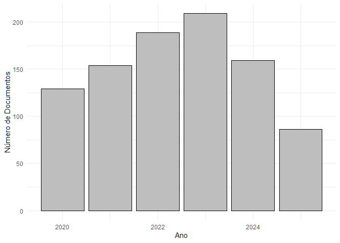
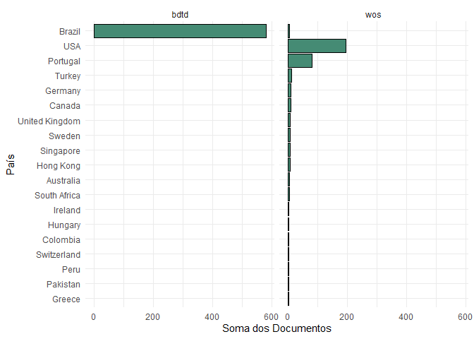
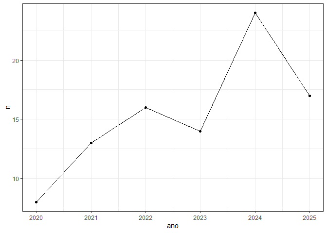

<!-- README.md is generated from README.Rmd. Please edit that file -->

## TCC - Maria Eduarda - Bibliometria

### Carregando Pacotes

``` r
library(tidyverse)
```

### Carregando a Base

``` r
base_wos <- readxl::read_xlsx("data_raw/wob_extraidos.xlsx") |> 
  janitor::clean_names() |> 
  mutate(
    abstract_1 = str_remove_all(abstract_1, "\r"),
    abstract_2 = str_remove_all(abstract_2, "\r"),
    research_areas   = str_replace_all(research_areas, "\n", " "),
    research_areas   = str_replace_all(research_areas, "  ", " "),
    titulo = str_remove_all(titulo, "\r|™"),
    autor = str_to_title(autor),
    nome_base = "wos"
  ) |> 
  rename( resumo = abstract_1)
base_me <- readxl::read_xlsx("data_raw/Arquivos Extraídos/search_result--1968698800-csv/search_result--1968698800-csv.xlsx") |> janitor::clean_names() |> 
  rename(autor = autor_a,ano = ano_de_defesa,
         instituicao = instituicao_de_defesa,
         pais = pais_da_instituicao_de_defesa) |> 
  mutate(pais = ifelse(pais == "Não informado pela instituição","Brasil",pais),
         assuntos_em_portugues = str_remove_all(assuntos_em_portugues,"\\|"),
         assuntos_em_ingles = str_remove_all(assuntos_em_portugues,"\\|"),
         autor = str_to_title(autor),
         nome_base = "bdtd")
```

``` r
glimpse(base_me) 
#> Rows: 587
#> Columns: 25
#> $ autor                                              <chr> "Reis, Thiago Nelso…
#> $ id_lattes_do_a_autor_a                             <chr> "http://lattes.cnpq…
#> $ orientadores                                       <chr> "TEIXEIRA, Mário An…
#> $ id_lattes_dos_orientadores                         <chr> "http://lattes.cnpq…
#> $ membros_da_banca                                   <chr> "TEIXEIRA, Mário An…
#> $ id_lattes_dos_membros_da_banca                     <chr> "http://lattes.cnpq…
#> $ titulo                                             <chr> "Sustentabilidade n…
#> $ ano                                                <dbl> 2024, 2025, 2021, 2…
#> $ instituicao                                        <chr> "Universidade Feder…
#> $ sigla_da_instituicao_de_defesa                     <chr> "UFMA", "UFMG", "UF…
#> $ pais                                               <chr> "Brasil", "Brasil",…
#> $ departamento_da_instituicao_de_defesa              <chr> "DEPARTAMENTO DE IN…
#> $ programa_de_pos_graduacao_da_instituicao_de_defesa <chr> "PROGRAMA DE PÓS-GR…
#> $ area_do_conhecimento_cn_pq                         <chr> "Ciência da Computa…
#> $ tipos_de_acesso                                    <chr> "openAccess", "open…
#> $ tipo_de_documento                                  <chr> "doctoralThesis", "…
#> $ assuntos_em_portugues                              <chr> "emissão de carbono…
#> $ assuntos_em_ingles                                 <chr> "emissão de carbono…
#> $ idioma                                             <chr> "por", "por", "por"…
#> $ resumo                                             <chr> "This thesis explor…
#> $ link_de_acesso                                     <chr> "https://tedebc.ufm…
#> $ identificador_persistente_ark                      <chr> "ark:/70116/0013000…
#> $ resumo_em_ingles                                   <chr> "Não informado pela…
#> $ referencia_bibliografica                           <chr> "REIS, Thiago Nelso…
#> $ nome_base                                          <chr> "bdtd", "bdtd", "bd…
```

## Juntando e tratando as Bases

``` r
base_completa <- rbind(base_wos |> 
  select(nome_base, autor, ano, titulo, instituicao, resumo, pais),
base_me |> 
  select(nome_base, autor, ano, titulo, instituicao, resumo, pais)
) |> 
  distinct() |> 
  mutate(
    pais = str_replace(pais, "BR|Brasil|brasil|brazil","Brazil")
  )
```

### Estatística Descritiva

#### Número de Documentos por Ano

``` r
base_completa |> 
  group_by(ano) |> 
  count() |> 
  ggplot(aes(ano, n)) +
  geom_col(color="black", fill="gray") +
  labs(x="Ano", y = "Número de Documentos") +
  theme_minimal()
```

<!-- -->

#### Número de Documentos por Ano / País

``` r
base_completa |> 
  group_by(ano,pais,nome_base) |> 
  count() |> 
  ggplot(aes(ano, n, fill=pais)) +
  geom_col(color="black") +
  labs(x="Ano", y = "Número de Documentos") +
  theme_minimal() +
  facet_wrap(~nome_base)
```

<!-- -->

#### Soma do número de documentos para o período todo (2020 a 2025)

``` r
base_completa |> 
  group_by(pais,nome_base) |> 
  count() |> 
  ungroup() |> 
  mutate(pais = fct_reorder(pais,n)) |> 
  ggplot(aes(y=pais, x=n)) +
  geom_col(color="black",fill="aquamarine4") +
  labs(x="Soma dos Documentos", y = "País") +
  theme_minimal() +
  facet_wrap(~nome_base)
```

<!-- -->
